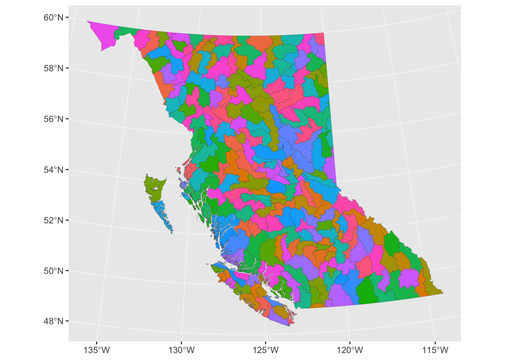
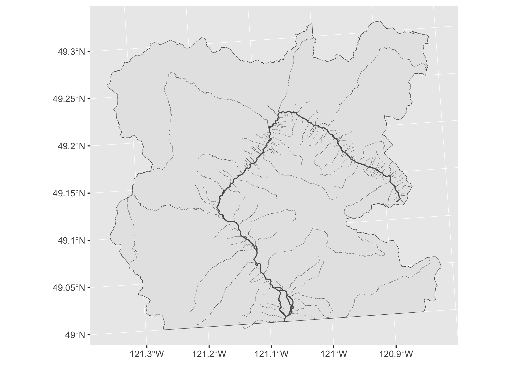

<!-- README.md is generated from README.Rmd. Please edit that file -->

[](https://www.tidyverse.org/lifecycle/#experimental)
[](https://travis-ci.org/poissonconsulting/fwabc)
[](https://ci.appveyor.com/project/poissonconsulting/fwabc)
[](https://codecov.io/github/poissonconsulting/fwabc?branch=master)
[](https://opensource.org/licenses/MIT)

# fwabc

`fwabc` is an R package to read data from the [BC Freshwater
Atlas](https://www2.gov.bc.ca/assets/gov/data/geographic/topography/fwa/fwa_user_guide.pdf).

## Installation

To install the latest development version from the Poisson drat
[repository](https://github.com/poissonconsulting/drat)

    if(!"drat" %in% installed.packages()[,1]) 
      install.packages("drat")
    drat::addRepo("poissonconsulting")
    install.packages("fwabc")

To install the latest development version from
[GitHub](https://github.com/poissonconsulting/fwabc)

    if(!"devtools" %in% installed.packages()[,1]) 
      install.packages("devtools")
    devtools::install_github("bcgov/bcdata")
    devtools::install_github("poissonconsulting/yesno")
    devtools::install_github("poissonconsulting/err")
    devtools::install_github("poissonconsulting/checkr")
    devtools::install_github("poissonconsulting/fwabc")

## Usage

### Function families

  - `fwa_read_` - read features from BC Freshwater Atlas layers.
  - `fwa_pull_` - return a modified version of some input (e.g. another
    input type, or tributaries of that input).
  - `fwa_search_` - match a regular expression to official named
    features.

### Read

Read features from available layers using the `fwa_read()` function:

``` r
library(ggplot2)
library(magrittr)
library(fwabc)

fwa_read(c("SKGT", 356439092), layer = "stream-network") 
#> Simple feature collection with 6913 features and 27 fields
#> geometry type:  LINESTRING
#> dimension:      XYZ
#> bbox:           xmin: 1339667 ymin: 454237.7 xmax: 1378650 ymax: 490447
#> epsg (SRID):    3005
#> proj4string:    +proj=aea +lat_1=50 +lat_2=58.5 +lat_0=45 +lon_0=-126 +x_0=1000000 +y_0=0 +ellps=GRS80 +towgs84=0,0,0,0,0,0,0 +units=m +no_defs
#> # A tibble: 6,913 x 28
#>    id    LINEAR_FEATURE_… WATERSHED_GROUP… EDGE_TYPE BLUE_LINE_KEY
#>    <chr>            <int>            <int>     <int>         <int>
#>  1 WHSE…        707548567              185      1000     356456840
#>  2 WHSE…        707562097              185      1000     356527445
#>  3 WHSE…        707555146              185      1000     356563680
#>  4 WHSE…        707549133              185      1000     356563266
#>  5 WHSE…        707556968              185      1000     356524850
#>  6 WHSE…        707562668              185      1000     356447754
#>  7 WHSE…        707548310              185      1050     356546082
#>  8 WHSE…        707555736              185      1000     356568843
#>  9 WHSE…        707566526              185      1000     356539239
#> 10 WHSE…        707549607              185      1000     356567543
#> # … with 6,903 more rows, and 23 more variables: WATERSHED_KEY <int>,
#> #   FWA_WATERSHED_CODE <chr>, LOCAL_WATERSHED_CODE <chr>,
#> #   WATERSHED_GROUP_CODE <chr>, DOWNSTREAM_ROUTE_MEASURE <dbl>,
#> #   LENGTH_METRE <dbl>, FEATURE_SOURCE <chr>, GNIS_ID <int>,
#> #   GNIS_NAME <chr>, LEFT_RIGHT_TRIBUTARY <chr>, STREAM_ORDER <int>,
#> #   STREAM_MAGNITUDE <int>, WATERBODY_KEY <int>, BLUE_LINE_KEY_50K <int>,
#> #   WATERSHED_CODE_50K <chr>, WATERSHED_KEY_50K <int>,
#> #   WATERSHED_GROUP_CODE_50K <chr>, GRADIENT <chr>, FEATURE_CODE <chr>,
#> #   OBJECTID <int>, SE_ANNO_CAD_DATA <chr>, FEATURE_LENGTH_M <dbl>,
#> #   geometry <LINESTRING [m]>
```

All `fwa_read_` functions return a [sf](https://github.com/r-spatial/sf)
object and require some combination of `WATERSHED_KEY` and
`WATERSHED_GROUP_CODE` as input.

``` r
fwa_lookup_layer
#> # A tibble: 11 x 3
#>    layer               WATERSHED_KEY WATERSHED_GROUP_CODE
#>    <chr>               <lgl>         <lgl>               
#>  1 stream-network      TRUE          TRUE                
#>  2 coastlines          TRUE          TRUE                
#>  3 watersheds          TRUE          TRUE                
#>  4 manmade-waterbodies TRUE          TRUE                
#>  5 obstructions        TRUE          TRUE                
#>  6 linear-boundaries   TRUE          TRUE                
#>  7 lakes               TRUE          TRUE                
#>  8 rivers              TRUE          TRUE                
#>  9 wetlands            TRUE          TRUE                
#> 10 watershed-groups    FALSE         TRUE                
#> 11 glaciers            FALSE         TRUE
```

Read features from multiple layers for Skagit River watershed group:

``` r
layers <- c("stream-network", "rivers", "lakes", "watershed-groups")
x <- lapply(layers, function(x) fwa_read("SKGT", layer = x))
names(x) <- layers

ggplot() + 
    geom_sf(data = x[["watershed-groups"]], size = 0.2) +
    geom_sf(data = x[["lakes"]], size = 0.3, fill = "steelblue") +
    geom_sf(data = x[["rivers"]], size = 0.3, fill = "steelblue") +
    geom_sf(data = x[["stream-network"]][x[["stream-network"]]$STREAM_ORDER > 2,], size = 0.07) 
```

<!-- -->

There is a convenience function for each layer,
e.g. `fwa_read_stream_network()`, `fwa_read_watershed_groups()`,
`fwa_read_coastlines()` etc. To read an entire layer, leave the default
`x = NULL`. Some layers (e.g. `stream-network` and `watersheds`) are
very large.

``` r
library(rmapshaper)
x <- fwa_read_watershed_groups(ask = FALSE) %>%
  # simplify with rmapshaper package
  rmapshaper::ms_simplify()  

ggplot() + 
  geom_sf(data = x, size = 0.05, aes(fill = WATERSHED_GROUP_NAME), show.legend = FALSE) 
```

<!-- -->

### Search and pull

`fwa_search_` and `fwa_pull_` functions can be used to find
`WATERSHED_KEY` or `WATERSHED_GROUP_CODE`.

Match a regular expression to an official stream name (`GNIS_NAME`) or
watershed group name (`WATERSHED_GROUP_NAME`):

``` r
fwa_search_gnis("skagi|scagi")
#> [1] "Skagit River"
fwa_search_watershed_group("skagi|scagi")
#> [1] "Skagit River"
```

Pull the `WATERSHED_KEY` or `WATERSHED_GROUP_CODE` from the official
name and provide to `fwa_read_`:

``` r
stream <- fwa_search_gnis("skagi|scagi") %>%
  fwa_pull_watershed_key() %>%
  fwa_read_stream_network()

wshed <- fwa_search_watershed_group("skagi|scagi") %>%
  fwa_pull_watershed_group_code() %>%
  fwa_read_watershed_groups()

ggplot() +
  geom_sf(data = wshed, size = 0.2) +
  geom_sf(data = stream) 
```

<!-- -->

### Tributaries

Use `fwa_pull_tributaries()` to get tributaries from a `WATERSHED_KEY`:

``` r
tribs <- fwa_search_gnis("skagit") %>%
  fwa_pull_watershed_key() %>%
  fwa_pull_tributaries(order = 1L) %>%
  fwa_read_stream_network()

ggplot() +
  geom_sf(data = wshed, size = 0.2) +
  geom_sf(data = stream) +
  geom_sf(data = tribs, size = 0.1) 
```

<!-- -->

### Lookup tables

`fwabc` provides three lookup tables (`fwa_lookup_gnis`,
`fwa_lookup_watershed_group`, `fwa_lookup_layer`), which can be useful
for finding layer names, named features or which layers have data for
particular features.

## Other packages

`fwabc` read functions use the
[`bcdata`](https://github.com/bcgov/bcdata) package (specifically,
`bcdata::bcdc_query_geodata()`) to query the freshwater atlas remotely.
`fwabc` provides convenience for common requests

``` r
fwa_read_stream_network(c("SKGT", 356439092))

#### ---- returns the same result as ---- ####

bcdata::bcdc_query_geodata("freshwater-atlas-stream-network") %>%
  bcdata::filter(WATERSHED_GROUP_CODE == "SKGT" | WATERSHED_KEY == 356439092) %>%
  bcdata::collect()
```

and resources/functions to get tributaries and official `GNIS_NAME`,
`WATERSHED_KEY` and `WATERSHED_GROUP_CODE`.

However, if you are very familiar with the atlas and require greater
filtering flexibility (or even want to use your own CQL), then we
suggest trying the fantastic `bcdata` package.

## Contribution

Please report any
[issues](https://github.com/poissonconsulting/fwabc/issues).

[Pull requests](https://github.com/poissonconsulting/fwabc/pulls) are
always welcome.

Please note that this project is released with a [Contributor Code of
Conduct](CONDUCT.md). By participating in this project you agree to
abide by its terms
